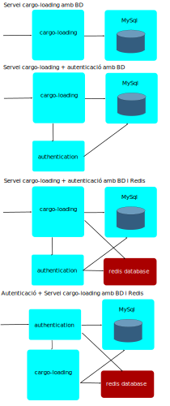
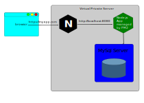
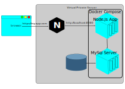

# onion-cargo-loading-service

## Descripció

Projecte d'un servei web per determinar si es poden encabir diversos elements
en un contenidor i si es així en quina disposició i ordre.
El servei ha de poder gestionar peticions de diversos clients, a on cada client
té uns contenidors preconfigurats diferents.
El servei s'ha de poder desplegar en diferents configuracions:

- Un servidor Ubunbtu amb PM2
- Un servidor Ubuntu amb docker compose
- Un o diversos servidors Ubuntu amb docker swarm
- Kubernetes
- Google Run (Serverless)

El servei es desenvoluparà amb NodeJS, ExpressJS
El loggin es farà amb Morgan i Winston.
Les API REST es faran amb Open API i swagger.
Les dades es guardaran en una BD MySql.
Es farà servir una BD Redis com a cache de la MySql.
Es testejarà amb mocha i artillery.

Posteriorment s'afegirà un altre servei per gestionar les claus de connexió
dels clients, obtenir estadístiques de connexió, poder bloquejar claus,
renovar-les i crear-ne de noves.

Com a útlim punt s'afegirà una base de dades Redis per tal de guardar en
memòria els contenidors preconfigurats i les claus de connexió dels clients
per agilitzar l'aplicació.

Hem de tenir en compte les diferents opcions de desplegament de les BD, ja que
les podrem tenir <https://cloud.google.com/blog/products/databases/to-run-or-not-to-run-a-database-on-kubernetes-what-to-consider>:

- En un o diversos VPS dedicats
- A dins de Kubernetes
- Fer servir BD autogestionades pel proveïdor de cloud, p.e. Cloud SQL o Memorystore for Redis



Es vol comprobar si una aplicació serverless feta amb contenidors realment té
els següents avantatges:

- Ús de contenidors ofereix més flexibilitat i rapidesa
- Serverless simplifica la configuració i l'escalabilitat
- Millora la productivitat dels desenvolupadors
- Facilita la recol·lecció de dades per poder obtenir coneixement i s'hi pot aplicar ML
- Redueix els costos d'infraestructura i informàtica

### Disseny de les API REST

Per dissenyar les API REST s'ha de tenir en compte:

- El nivell de granularitat: si la granularitat és molt fina s'exposaran molts
  recursos i obligarà a fer moltes crides per relitzar una operació, en canvi
  si la granularitat és molt grossa hi haurà poca flexibilitat i dificultarà la
  reutilització de l'API. S'ha de triar un equilibri entre:
  - La mida de la resposta
  - El número de crides de la API
  - Mantenibilitat i reusabilitat
  - Escalabilitat
  - Necessitats del negoci
- Basar el disseny en els objectes del negoci i no en taules de la BD
- Fer servir HATEOAS per dotar d'inteligència al client, que a partir d'una
  crida sigui capaç de fer altres crides.
- Gestionar els errors de forma consistent, centralitzar els errors en un
  array JSON pot ser una bona idea. <https://www.rfc-editor.org/rfc/rfc7807>.

Exemple de crida amb HATEOAS:

```javascript
{
 “id”: 1,
 “name”: “Blog”,
 “links”: [
  {
   “href”: “1/posts”,
   “rel”: “posts”,
   “type” : “GET”
   }, 
  {
   “href”: “1/comments”,
   “rel”: “comments”,
   “type” : “GET”
   }
 ]
}
```

Exemple d'array d'errors:

```javascript
{
 “errors”: [
   {
   “code”: “10003”,
   “message”: “invalid address field”
   },
   {
   “code”: “10004”,
   “message”: “birthday field is requried”
   }
   ]
 }
```

## Com treballar amb el projecte

Pojecte hostatjat al GitHub, per col·laborar treballar de la següent manera:

1. Fer un fork del projecte al teu GitHub
2. Clona el codi en local
3. Crea el fitxer config/config.js amb la configuració del servei:
4. Crea una branca, posa-li un bon nom, que indiqui el tipus de canvi (bug,
   fix, feat, doc) i expliqui de que es tracta.
   Ex: "bug:error when array is null"
5. Fes els canvis i guarda'ls en local, cada canvi amb el seu commit, també amb
   un bon nom
6. Ves a la branca principal i sincronitza la teva branca master amb el del
   repositori original
7. Guarda els canvis al teu GitHub
8. Crea el pull request

Fitxer config/config.js d'exemple:

```javascript
module.exports = {
    client: "nom del client que el té desplegat",
    service: "nom del servei"
}
```

Per veure totes les rutes del projecte executar-lo amb la camanda:
`DEBUG=express:* node bin/www`

Mes info a:

- <https://www.freecodecamp.org/espanol/news/como-hacer-tu-primer-pull-request-en-github/>
- <https://betterprogramming.pub/improve-your-pull-requests-and-code-review-in-6-easy-steps-ecf6dfa1c6d5>
- <https://www.paradigmadigital.com/dev/testeo-api-rest-mocha-chai-http/>
- <https://www.freecodecamp.org/news/how-to-build-explicit-apis-with-openapi/>
- <https://github.com/kogosoftwarellc/open-api/tree/master/packages/express-openapi#readme>

## Desplegament

### Desplegar amb PM2 en un VPS

Característiques:

1. Un sol servidor
2. Configuració senzilla
3. Poca escalabilitat
4. Entorns no aïllats



Per tal de deplegar l'aplicació amb PM2 en un servidor farem servir un script
que ens desplegui tots els components necessaris en un servidor Ubuntu de
clouding.io

En el mateix servidor hi instalarem una BD MySQL per guardar les dades.

Opcions d'escalabilitat:

1. Enlloc de crear els serveis al PM2 un a un, es pot fer servir el fitxer
   ecosystem que permet crear-los tots de cops i fer servir múltiples
   instàncies d'una mateixa app amb un balencejador de càrrega del PM2.
2. Es pot iniciar els serveis PM2 amb la opció -i que els crea en mode cluster,
   es a dir, un servei per cada CPU del servidor: `pm2 start app.js -i max`
3. Es poden aixecar nous servidors i desplegar noves instàncies, però es
   necessita un balencejador de càrrega entre tots els servidors.

Exemple opció escalabilitat 1, amb fitxer ecosystem:

```javascript
{
  "apps" : [{
    "name"        : "worker-app",
    "script"      : "./worker.js",
    "watch"       : true,
    "env": {
      "NODE_ENV": "development"
    },
    "env_production" : {
       "NODE_ENV": "production"
    }
  },{
    "name"       : "api-app",
    "script"     : "./api.js",
    "instances"  : 4,
    "exec_mode"  : "cluster"
  }]
}
```

### Construim una imatge del contenidor i l'executem

Per poder desplegar amb docker compose, swarm kubernetes o Cloud Run primer hem
de crear l'aplicació en un contenidor.

```bash
# Mirem quines imatges tenim en local
$ docker images

# Creem una imatge en local a partir del Dockerfile
# docker build --tag <nom de la nova imatge> <ruta del fitxer dockerfile>
# Posem una nova versio cada vegada
$ docker build --tag  codebiting/onion-cargo-loading:v1  .

# Verifiquem que la imatge s’ha creat correctament, per això mirem si la imatge existeix.
$ docker images

# Executem la imatge en mode interactiu
$ docker run -it -p 8080:8080 -d codebiting/onion-cargo-loading:v1

# Verifiquem que el contenidor està actiu, amb els ports correctes i mirem els logs que deixa:
$ docker ps
$ docker logs <container id>
$ docker inspcet <container id>
# Veure tots els contenidors (els finalitzats i els en execució)
$ docker ps -a

# Comprovem que l’aplicació funciona executant un navegador web l’adreça:
[http://<my.servlet.host>:8080/api-documentation](http://localhost:8080/api-documentation/)

# Entrem a dins del contenidor pel que sigui:
$ docker exec -it <container id> /bin/bash
# Si esta parat ho podem fer d aquesta manera
$ docker start -ai <container id>

# Parem l’execució del contenidor. Podem fer-ho de dues maneres diferents:
$ docker stop <container id>
$ docker kill <container id>
```

### Executem el contenidor amb docker compose

<https://docs.docker.com/compose/>
<https://docs.docker.com/compose/production/>
<https://www.educative.io/blog/docker-compose-tutorial>

Característiques:

1. Un sol servidor
2. Configuració senzilla, però més complicada que amb PM2, per gestionar 
   diversos contenidors
3. Poca escalabilitat
4. Entorns aïllats

Per tal de deplegar l'aplicació amb docker compose en un servidor farem servir
un script que ens desplegui tots els components necessaris en un servidor
Ubuntu de clouding.io

Al mateix servidor hi instalarem un docker amb MySQL per guardar-hi les dades.



### Executem el contenidor amb docker swarm

<https://docs.docker.com/engine/swarm/>

Característiques:

1. Un o diversos servidors
2. Configuració complexa
3. Escalabilitat
4. Entorns aïllats

### Executem el contenidor amb kubernetes

### Executem el contenidor amb Cloud Run

## Comparativa dels diferents modes de desplegament

| Mode de desplegament | Màxima escalabilitat | Temps per canviar l'escalabilitat |
|-|-|-
| PM2 | De 1 a N serveis per servidor | Segons a minuts: s'ha de modificar l'ecosystem i reiniciar PM2 |
| Docker compose | | |
| Docker swarm | | |
| Kubernetes | | |
| Cloud Run | | |

## Comparativa dels tests amb artillery

Escenaris:

1. Un client fa N consultes per segon durant 60 segons
2. Un client durant 60 segons fan de 1 a Y consultes per segon
3. X clients fan N consultes per segon durant 60 segons
4. X clients durant 60 segons fan de 1 a Y cosultes per segon

| Mode de desplegament | Escenari 1 | Escenari 2 | Escenari 3 | Escenari 4 |
|-|-|-|-|-|
| PM2 1 servei |  |  |  |  |
| PM2 mode cluster + Redis |  |  |  |  |
| Docker compose | | |  |  |
| Docker compose + Redis | | |  |  |
| Docker swarm + Redis | | |  |  |
| Kubernetes + Redis | | |  |  |
| Cloud Run + Redis | | |  |  |

## Log de canvis

V 0.0.0 - Característiques
